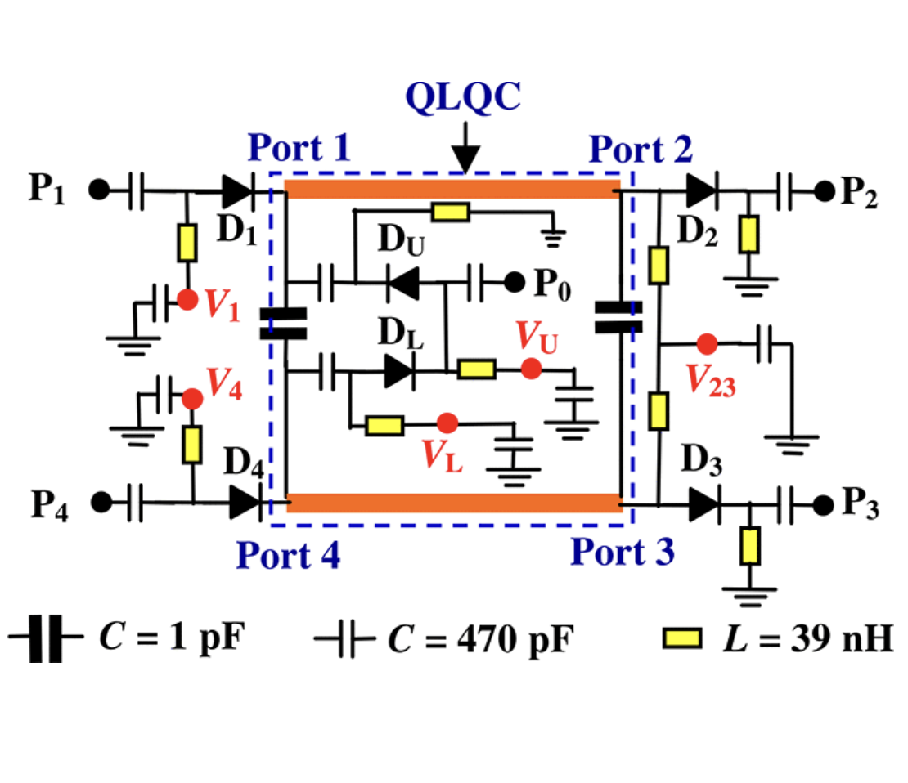

# High-Frequency-Circuits-for-Systems-on-Chip-Feeding-Network-for-Antenna-Arrays
# Feeding Network for Antenna Arrays
  - ✅ Define the equivalent circuit model
  - ✅ Model each branch as a microstrip transmission line with characteristic impedance Z0.
  - ✅ Insert power dividers and couplers (e.g., Wilkinson) to generate the array paths.
  - ✅ Model the PIN diodes as switches:
    - ON = low resistance (closed circuit)
    - OFF = parasitic capacitance (open circuit)
   
  - ✅ Network construction in Qucs
    - Use microstrip line or TL components for the main branches.
    - Insert DC blocking capacitors and virtual bias resistors to simulate diode bias.
    - Connect the outputs to the antenna ports (simulation points).
     
  - ✅ S-parameter simulation
  - ✅ Perform AC Sweep or S-parameter analysis for all diode configurations.
  - ✅ Check:
    - S11: input matching
    - S21…S2N: power distribution among paths
    - Relative phase between outputs
   
  - ✅ Analysis of dynamic configurations

    - Simulate multiple diode switching states to see how power distribution and phase to the antennas change.
    - Evaluate losses and isolation between branches.
     
  - ✅ Optimization

  - ✅ Modify line lengths or impedances in the microstrip model to optimize:
    - Minimum insertion loss (low losses)
    - Maximum isolation between paths
    - Desired phase for beamforming

## CIRCUIT DESIGN WITH SCHEMATIC

*Figure 1: Schematic of the reconfigurable antenna designed in QUCS.*
### 📂 Simulation Files
The source files for the simulation in QUCS are available here:
* [Project Schematic (.sch)](./file%20si%20simulazione/HFC_Project.sch)
* [Simulation Data (.dat)](./simulation%20files/HFC_Project.dat)
---
### 📄 Final Documentation
For a detailed analysis of the results and methodology, see the [Technical Report (PDF)](./Written_Report_HFC.pdf).

Translated with DeepL.com (free version)
